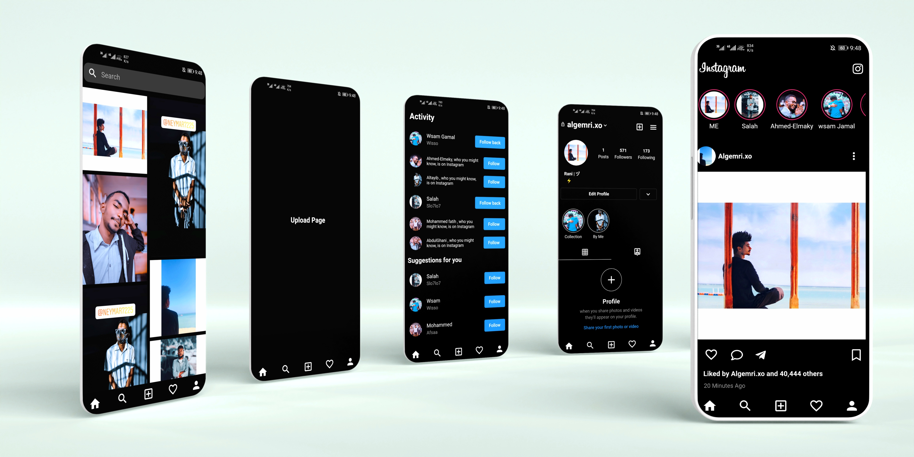

# Instagram Clone

This is a Flutter application that replicates some of the features and UI elements of the Instagram app.

## Features

- Feeds: Display posts from users you follow.
- Search: Search for users, hashtags, and locations.
- Upload: Upload photos and videos to your profile.
- Activity: View notifications and activity on your posts.
- Profile: View and edit your profile information and posts.

## Screenshots

## App Preview

## Getting Started

1. Clone this repository.
2. Ensure you have Flutter installed on your machine.
3. Run `flutter pub get` to install dependencies.
4. Run `flutter run` to launch the app on your device or emulator.

## Contributing

Contributions are welcome! Please feel free to submit pull requests to contribute new features, bug fixes, or improvements.
